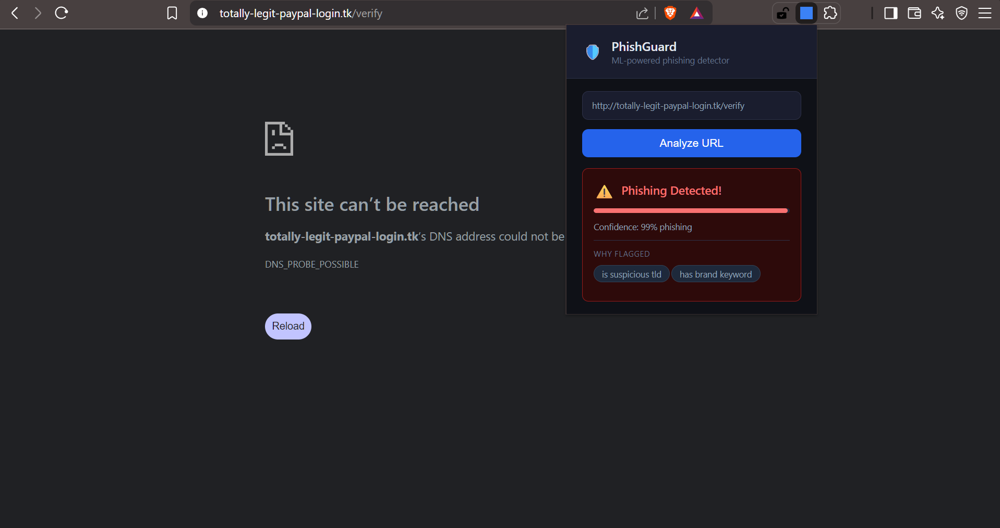

# 🛡️ PhishGuard — ML-Powered Phishing URL Detector


A real-time phishing URL detector built from scratch with machine learning,
custom data structures, a deployed REST API, and a Chrome extension.

**🔗 Live API:** https://phishinguard.onrender.com/docs  
**🎥 Demo Video:** [coming soon]

---

## 🖥️ Demo



*Chrome extension detecting a phishing URL with 99% confidence,
showing exactly why it was flagged.*

---

## 🏗️ Architecture

URL Input
│
▼
Bloom Filter ──► Known Safe Domain → return instantly (O(1))
│
▼ Unknown domain
Feature Extractor (27 features)
│
▼
XGBoost Classifier
│
▼
Verdict + Explanation (top suspicious features)

---

## 🔬 Built From Scratch — No Shortcuts

This is not a tutorial follow-along. Every core component was implemented manually:

| Component | What it does | Why it matters |
|-----------|-------------|----------------|
| **URL Parser** | Splits URL into protocol, domain, TLD, path, query | Foundation for all features |
| **Trie** | O(m) lookup against known phishing domains | Faster than linear scan |
| **Bloom Filter** | Probabilistic fast-path for 100K benign domains | Screens safe URLs in microseconds |
| **Shannon Entropy** | Measures randomness of URL characters | Detects obfuscated phishing strings |
| **Edit Distance** | Dynamic programming to catch typosquatting | Catches paypa1.com, g00gle.com |
| **27-feature extractor** | TLD, IP detection, brand keywords, char ratios | Full signal for the ML model |

---

## 📊 Model Performance

| Metric | Score |
|--------|-------|
| Accuracy | 87% |
| Precision | 88% |
| Recall | 87% |
| ROC-AUC | 0.966 |
| Training set | 100K URLs (balanced) |
| Inference time | <100ms |

---

## 🚀 Run Locally

```bash
git clone https://github.com/Codebase-archie/phishguard.git
cd phishguard
python -m venv venv
venv\Scripts\activate
pip install -r requirements.txt
uvicorn api.main:app --reload
```

Test it:
```bash
curl -X POST "http://localhost:8000/predict" \
  -H "Content-Type: application/json" \
  -d '{"url": "http://paypal-login.tk/verify"}'
```

---

## 🔌 Chrome Extension

1. Open `chrome://extensions`
2. Enable **Developer Mode** (top right)
3. Click **Load unpacked** → select the `extension/` folder
4. Click the PhishGuard icon on any webpage

---

## 📁 Project Structure

phishguard/
├── src/
│   ├── url_parser.py       # Custom URL tokenizer — no libraries
│   ├── bloom_filter.py     # Bloom filter — MD5 hashing + bytearray
│   ├── features.py         # 27-feature extractor + Shannon entropy
│   └── build_dataset.py    # Data pipeline
├── notebooks/
│   ├── 01_data_exploration.ipynb
│   └── 03_models.ipynb
├── api/
│   └── main.py             # FastAPI — /predict endpoint
├── extension/              # Chrome extension — Manifest V3
│   ├── manifest.json
│   ├── popup.html
│   ├── popup.js
│   └── background.js
└── models/
└── model_light.pkl     # XGBoost model (0.1MB)

---

## 📬 API Reference

**POST** `/predict`

Request:
```json
{ "url": "https://example.com" }
```

Response:
```json
{
  "url": "http://paypal-login.tk/verify",
  "score": 0.992,
  "verdict": "phishing",
  "bloom_cached": false,
  "top_features": [
    {"name": "is_suspicious_tld", "value": 1.0},
    {"name": "has_brand_keyword", "value": 1.0}
  ]
}
```

---

## 🛠️ Tech Stack

`Python` `XGBoost` `scikit-learn` `FastAPI` `Pandas` `NumPy`  
`Chrome Extensions API (Manifest V3)` `Render` `Jupyter`

---

## 📖 Key Concepts You Can Ask Me About

- How the Bloom filter works and its false positive rate
- Why Shannon entropy detects phishing URLs
- Precision vs recall tradeoff in security contexts
- Why XGBoost outperforms Logistic Regression here
- How edit distance catches typosquatting domains